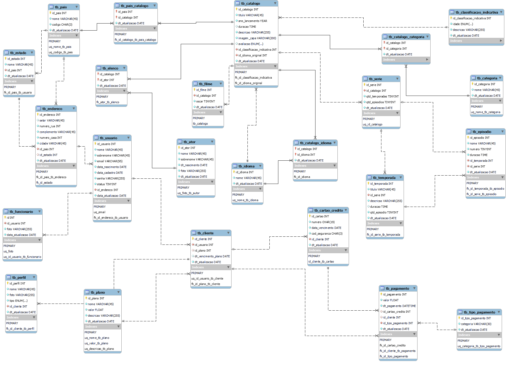

# Projeto Banco de dados

Este projeto tem intuito de demonstrar o conteúdo aprendido em sala de aula no curso de **DBA** ofertado pelo SENAI. O projeto escolhido foi de uma plataforma de streaming fictícia. segui abaixo a regra de negócio;
regra de negocio:

     Você como DBA deve projetar da melhor forma possível e segura o banco de dados que atenda a necessidade da regra de negocio abaixo a fim de deixar um ambiente saudável, segura e satisfatório ao cliente final. Prevenindo quaisquer eventuais problemas de dados equivocados. Para isso use de todos os seus conhecimentos adquiridos em aula e mais além. 
     A produtora de um novo streamer levantou alguns requisitos para poder começar o seu negocio, após uma conversa detalhada o analista chegou na seguinte situação. É importante saber sobre cada filme em seu catalogo o titulo, uma breve descrição contendo sua sinopse, ano de seu lançamento, idioma original, idiomas disponíveis, duração, nota de avaliação (medida em ate no máximo 5 estrelas), seu elenco, pais de origem, sua categoria e a imagem de capa. Já para os atores é de grande importância salvar seu primeiro nome, sobrenome, data de nascimento e uma foto, os atores somente devem ser cadastrado se tiver pelo menos um filme ou série atrelados a eles, e o mesmo vale para o filmes, somente devem ser cadastrados junto a seu elenco. As categorias terão somente o nome e serão cadastradas apenas quando houverem filmes atrelados a elas. Um filme ou serie pode estar vinculadas a mais de uma categoria para melhor serem localizadas na plataforma. Para as séries se repetem os atributos dos filmes porém deve-se conter a quantidade de temporadas também, e precisa-se saber a quantidade de episódios de cada série. Os episódios devem conter seu código, numero, titulo, duração, descrição, imagem de capa e temporada. Já as temporadas devem constar o titulo, descrição e quantidade de episódios. Tanto filmes quando séries devem de ter sua classificação indicativa. Para a classificação deve-se saber o código, idade e descrição. Os filmes e séries somente devem ter atribuídos uma única classificação.
      Uma vez estabelecida as regras de negocio do catalogo, é hora de estabelecer as regras dos clientes. 
      Os clientes consumidores do serviço também terão seus dados cadastrados neste banco, para estes o importante é saber primeiro nome, sobrenome, e-mail, endereço, se este cliente esta ativo ou inativo, data de nascimento, data de cadastro, senha, plano escolhido e data de vencimento. Para os endereços é importante saber o pais de origem deste cliente, uma vez que é uma rede de streamer mundial. Os planos devem conter seu valor e descrição. Os mesmos dados dos clientes devem ser gerados para os funcionários do streamer, pois eles deveram ser responsáveis pela manutenção da plataforma e para estes também se deve atribuir uma imagem. O controle de pagamento de cada cliente também é registrado, contendo o valor, e forma de pagamento, data do pagamento, para o caso de pagamentos realizados com o cartão deve-se saber os dados do cartão. 
      Além do dito acima chegou-se em algumas particularidades para este negocio: 
 - As imagens serão salvas em um servidor de arquivos a parte, restando ao banco salvar somente o link das imagens referenciadas. 
 - Todos os dados string devem ser salvos em minúsculo. 
- Todos os registros devem conter a data da sua ultima inserção/atualização. 
- Como os episódios podem ser lançados em datas diferentes a duração de uma série deve ser sempre recalculado base em seus episódios.
- Clientes só podem ficar inativos quando não possuírem contas pendentes. 

## Modelo Conceitual

## Modelo Logico

## Tabelas

- tb_classificacao_indicativa  
- tb_categoria
- tb_idioma
- tb_tipo_pagamento
- tb_país
- tb_plano
- tb_ator
- tb_estado
- tb_catalogo
- tb_filme
- tb_catalogo_idioma
- tb_pais_catalogo
- tb_endereco
- tb_usuario
- tb_funcionario
- tb_cliente
- tb_perfil
- tb_cartao_credito
- tb_pagamento
- tb_catalogo_categoria
- tb_elenco
- tb_serie  
- tb_temporada
- tb_episodio

## Views

- **vw_usuario:** Mostra os usuários e seus atributos.
- **vw_catalogo:** Mostra os dados do catálogo.
- **vw_episodio:** Mostra os dados dos episódios.
- **vw_temporada:** Mostra os dados da temporada.
- **vw_ator:** Mostra os dados dos atores.
- **vw_pagamento:** Mostra os dados do pagamento.
- **vw_perfil:** Mostra os dados dos perfis.

## Funções

- **fn_remover_acento:** Esta função remove acentos de palavras acentuadas e caracteres especiais por espaço vázio. 
- **fn_valida_texto:** Esta função realiza a validação do texto, nele eu posso decidir a quantidade mínina de caractere que o usuário pode digitar, essa função possui a função citada acima dentro dos côdigos dela.

## Procedures

- **sp_insert_classificacao_indicativa:** Esta procedure faz a inserção de dados já com validação.
- **sp_update_classificacao_indicativa:** Esta procedure faz a atualização das classificacões indicativas.
- **sp_delete_classificacao:** Esta procedure realiza o delete de classificações indicativas.
- **sp_insert_categoria:** Esta procedure faz a inserção validada de categorias.
- **sp_update_categoria**:** Esta procedure faz a atualização validada das categorias.
- **sp_delete_categoria:** Esta procedure faz a remoção de categorias.
- **sp_insert_idioma:** Esta procedure faz a inserção validada de idiomas.
- **sp_update_idioma:** Esta procedure faz a atualização validada de idiomas na tabela.
- **sp_delete_idioma:** Esta procedure faz a remoção de idiomas da tabela.
- **sp_insert_tipo_pagamento** Esta procedure faz a inserção validada de formas de pagamento, na tabela.
- **sp_update_tipo_pagamento** Esta procedure faz a atualização validada de formas de pagamento, na tabela.
- **sp_delete_tipo_pagamento** Esta procedure faz a remoção de formas de pagamento, na tabela.
- **sp_insert_pais** Esta procedure faz a inserção validada de novos países na tabela.
- **sp_update_pais** Essa procedure valida e depois atualiza os países no banco.
- **sp_delete_pais** Essa procedure remove países da tabela.
- **sp_insert_plano** Essa procedure faz a inserção de planos no banco.
- **sp_update_plano** Essa procedure valida e depois atualiza os planos.
- **sp_delete_plano** Essa procedure deleta os planos.
- **sp_insert_ator** Essa procedure valida as strings e depois insere atores.
- **sp_update_ator** Essa procedure valida as strings e depois atualiza a tabela atores.
- **sp_delete_ator** Essa procedure deleta atores da tabela.
- **sp_insert_filme** Essa procedure valida as strings e depois faz a inserção de filmes na tabela.
- **sp_update_filme** Essa procedure valida as strings e depois faz atualiza a tabela filmes na tabela.
- **sp_delete_filme** - Essa procedure remove filmes da tabela.
- **sp_insert_catalogo_idioma** Essa procedure realiza inserções na tabela catalogo_idioma.
- **sp_pais_catalogo**  Essa procedure realiza inserções na tabela pais_catalogo.
- **sp_insert_usuario** Essa procedure realiza a validação e inserção de usuarios.
- **sp_insert_funcionario** Essa procedure insere funcionários na tabela, após validação.
- **sp_insert_cliente** Essa procedure insere clientes noatabela, após validação.
- **sp_insert_perfil** Essa procedure insere perfis após validação.
- **sp_insert_cartao_credito** Essa procedure valida e depois insere cartões na tabela.
- **sp_insert_pagamento**  Essa procedure valida e depois insere pagamentos no banco.
- **sp_insert_catalogo_categoria** Essa procedure valida e depois insere dados na tabela.

## Triggers

- **tr_insert_episodio_temporada** Essa trigger atualiza a tabela temporada após um episódio ser adicionado na tabela de episódios.
- **tr_insert_episodio_serie** Essa trigger atualiza a tabela série após a adição de episódios na tabela de episódios.
tr_insert_episodio_serie
- **tr_insert_temporada_serie** Essa trigger atualiza a tabela de séries após ser adicionada uma temporada.

## Scripts

|Scripts    |Clique aqui|
|-----------|-----------|
|DDL        |[Clique aqui](./scripts/script_CREATE.sql)|
|Dados      |[Clique aqui](./scripts/script_INSERT.sql)|
|Views      |[Clique aqui](./scripts/viewsprojetofina-finalizado.sql)|
|Funções    |[Clique aqui](./scripts/script_FUNCTION.sql)|
|Procedures |[Clique aqui](./scripts/script_PROCEDURE.sql)|
|Triggers   |[Clique aqui](./scripts/script_TRIGGER.sql)|
|Dumps      |[Clique aqui](./Dumps/DumpFullDb_streaming21062023.sql)|

   

